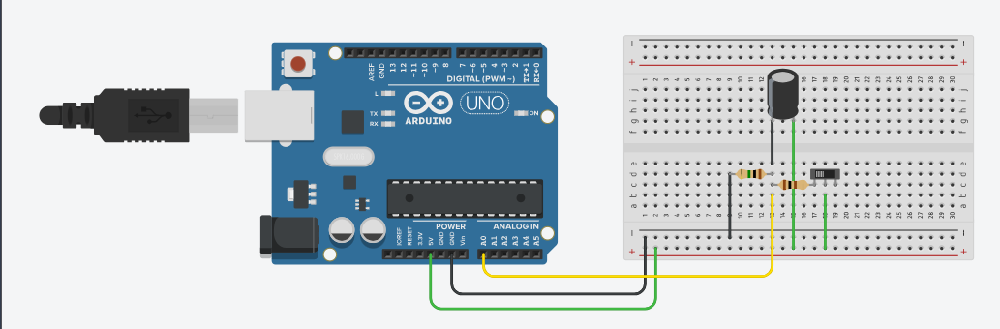
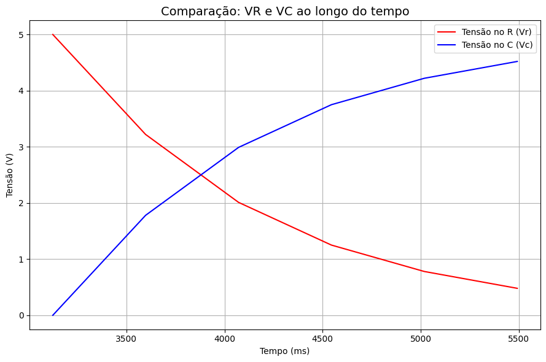

# Projeto Arduino: Análise de Circuito RC (Resistor-Capacitor)

## Descrição

Este projeto tem como objetivo analisar experimentalmente o comportamento de um circuito RC (Resistor-Capacitor) utilizando o Arduino UNO. Através da montagem de um circuito simples, é possível observar como a tensão nos terminais do resistor (VR) e do capacitor (VC) varia ao longo do tempo durante o processo de carga e descarga do capacitor.

O sistema realiza a leitura da tensão no resistor através da porta analógica do Arduino (A0), calcula a tensão no capacitor por diferença, e envia os dados organizadamente ao monitor serial do Arduino IDE. Com estas informações é possível gerar gráficos da evolução das tensões e compreender fenômenos elétricos da constante de tempo RC.

## Materiais Utilizados

- 1x Arduino UNO
- 1x Protoboard
- 2x Resistores (valor: 100Ω e 1MΩ)
- 1x Capacitor 
- 7x Jumpers para conexões
- 1x Interruptor 

## O que o Projeto Faz

- Monta um circuito RC clássico na protoboard seguindo o esquema abaixo.
- Utiliza o Arduino para ler a tensão no resistor (VR) em intervalos regulares.
- Calcula a tensão no capacitor (VC) como complementar de VR em uma alimentação de 5V.
- Exibe os valores de tempo, VR e VC de maneira organizada no monitor serial.
- O circuito pode ser operado com um interruptor para iniciar o processo de carga/descarga.

---

## Foto do Circuito

<!-- Adicione aqui uma imagem explicando o circuito conectado: -->


---

## Gráfico Gerado

<!-- Adicione aqui uma imagem do gráfico/quadro gerado com os dados: -->


---

## Vídeo Demonstrativo 

- [Simulação no Tinkercad](https://www.tinkercad.com/things/6OewxfNLacU-sistema-rc-capacitor?sharecode=undefined)
- [Vídeo demonstrativo](https://drive.google.com/file/d/1IuUY4gFpoeRrwIZFXpklnB-tPTZ-ZXlx/view?usp=sharing)

---


## Código em C++ do circuito

```
#define RC_PIN   A0

void setup() {
  Serial.begin(9600);
  Serial.println("Sistema RC - Medindo tensões");
}

void loop() {
  unsigned long tempo = millis();
  int valorLido = analogRead(RC_PIN);

  float tensaoResistor = valorLido * (5.0 / 1023.0);   
  float tensaoCapacitor = 5.0 - tensaoResistor;        

  Serial.print(tempo);
  Serial.print(" ms VR = ");
  Serial.print(tensaoResistor, 2);
  Serial.print("V VC = ");
  Serial.print(tensaoCapacitor, 2);
  Serial.println("V");

  delay(400);
}


```

